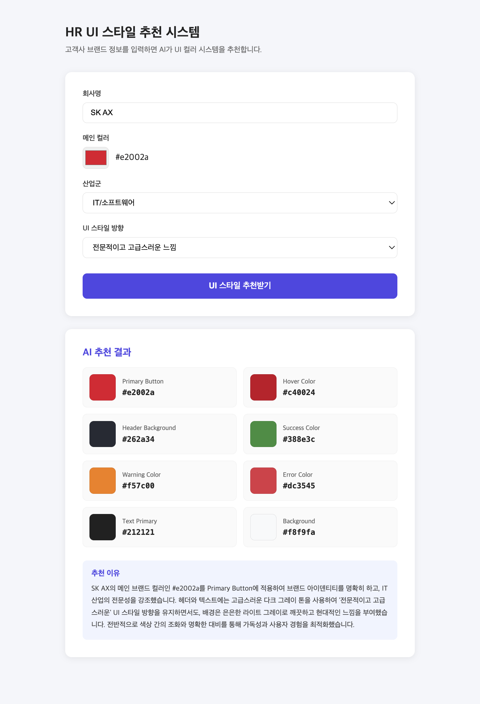

# HR UI 스타일 추천 시스템

고객사 브랜드 정보를 입력하면 Gemini AI가 HR 플랫폼에 적합한 UI 컬러 시스템을 자동 추천합니다.



---

## 개발 배경

HR 솔루션 구축 프로젝트에 반복 투입되며, PL들이 매번 유사한 기획서를 작성하고 개발자들이 비슷한 기능을 반복 구현하는 구조를 직접 목격했습니다. 프론트엔드 개발자로서 저 역시 프로젝트마다 고객사 CI에 맞춘 컬러 적용과 화면 커스터마이징을 수작업으로 반복했습니다.

이 반복 업무를 AI로 전환할 수 있다는 확신을 갖고, 브랜드 정보를 입력하면 UI 스타일을 자동 추천하는 PoC를 직접 구현했습니다.

---

## 주요 기능

- 회사명, 메인 컬러, 산업군, UI 스타일 방향 입력
- Gemini AI가 8가지 UI 컬러 시스템 자동 추천
- 컬러 박스로 결과를 시각적으로 확인
- 산업군과 브랜드 특성을 고려한 추천 이유 제공

---

## 기술 스택

| 분류 | 기술 |
|------|------|
| Frontend | Vue.js 3, Vite |
| AI | Gemini API (@google/genai) |
| 배포 | Vercel |

---

## 프로젝트 구조

```
src/
├── components/
│   ├── BrandForm.vue      # 브랜드 정보 입력 폼
│   └── ColorResult.vue    # 추천 결과 컬러 카드
├── services/
│   └── gemini.js          # Gemini API 호출 및 응답 파싱
└── App.vue                # 루트 컴포넌트
```

---

## 실행 방법

```bash
# 패키지 설치
npm install

# .env 파일 생성
VITE_GEMINI_API_KEY=발급받은_API_키

# 개발 서버 실행
npm run dev
```

---

## 한계점 및 개선 방향

현재는 브랜드 정보를 입력하면 AI가 UI 컬러 시스템을 **추천**하는 수준입니다.

궁극적으로는 AI가 실제 솔루션 코드를 읽고 컬러 변수와 컴포넌트를 **자동으로 수정**하는 방향으로 발전시키고자 합니다. 이를 통해 HR 솔루션 구축 시 투입 인원과 반복 작업을 줄이고, 기획자도 직접 UI를 구성할 수 있는 환경을 목표로 합니다.

---

## 데모

🔗 [라이브 데모 보기](https://hr-ui-poc.vercel.app)